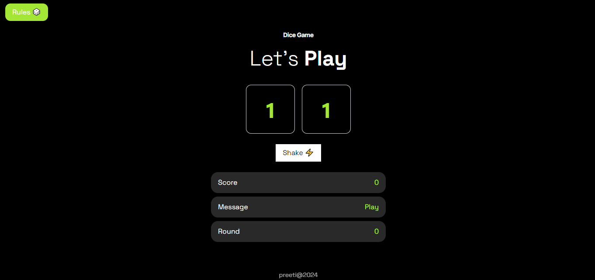
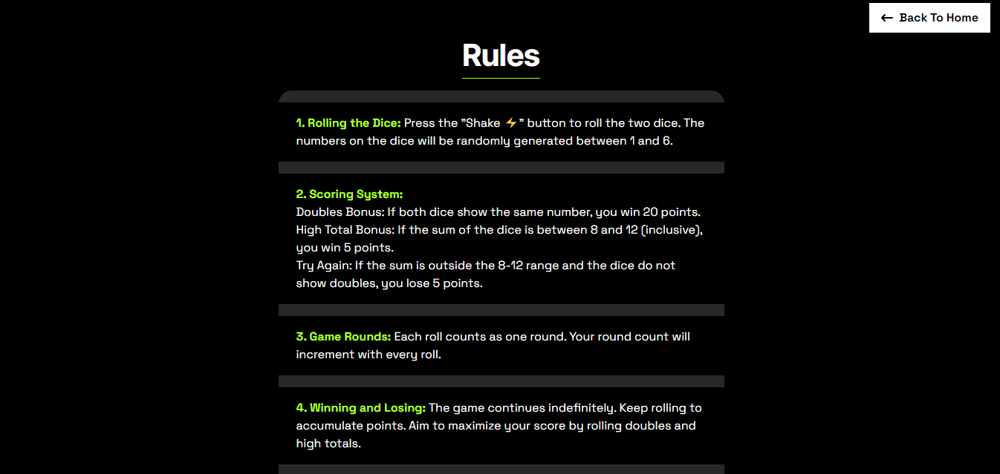
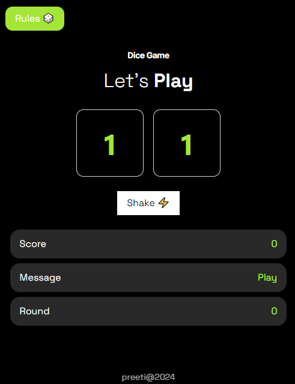
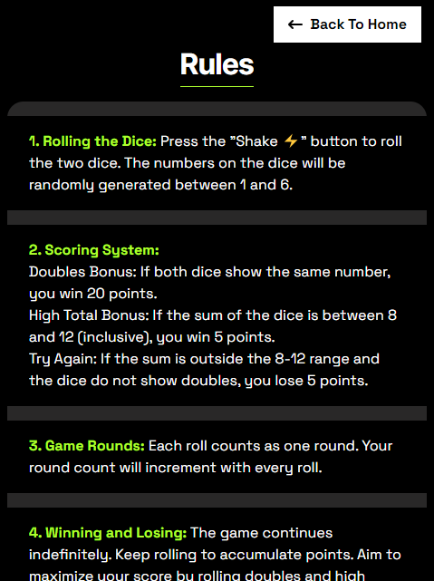

# Dice Game 🎲

This is a simple Dice Game built with React, Vite, and TailwindCSS. The game involves rolling two dice and scoring points based on the numbers rolled.

## Features ✨

- Roll two dice and get random numbers between 1 and 6.
- Score points based on the rules:
  - Win 20 points if both dice show the same number.
  - Win 5 points if the sum of the dice is between 8 and 12 (inclusive).
  - Lose 5 points otherwise.
- Track the number of rounds played.
- Simple and clean user interface with TailwindCSS.

## Installation ⚙

1. Clone the repository:

   ```sh
   git clone https://github.com/preetisharma002/dice-game-app.git
   cd dice-game-app

   ```

2. Dependencies:
   ```sh
   npm install
   ```
3. Run the app:
   ```sh
   npm run dev
   ```
4. Enjoy your app:

   App is running on port http://localhost:5173/

## Screenshots





